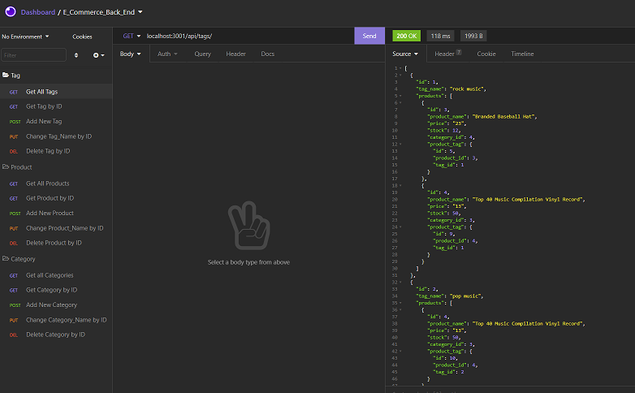

# Object-Relational Mapping (ORM): E-Commerce Back End

  

## Description

This code replicates the back end for an e-commerce site.  It includes a working Express.js API to use Sequelize to interact with a MySQL database.
  

## Table of Contents

- [Installation](#installation)
- [Usage](#usage)
- [License](#license)
- [Collaborators](#collaborators)
- [Questions](#questions)
  

## Installation

This repository can be cloned by using the following command:
~~~
gh repo clone rmoatman/E_Commerce_Back_End
~~~

Then, install the inquirer, MySql, and express dependencies using the command:
~~~
npm install
~~~
 

## Usage

To run the app, use the command:
~~~
node express.js
~~~
A demonstration video can be found here: XXX
  
## License

This work is covered under MIT License.  For more information, click on the license badge above.
  

## Collaborators

Please contact me using the information below for questions, comments, and suggestions.
  

## Questions

Have a question or comment?  Please contact me at: 
Raemarie Oatman 
GitHub Profile: github.com/rmoatman 
raemarie.oatman@gmail.com 

# E_Commerce_Back_End
